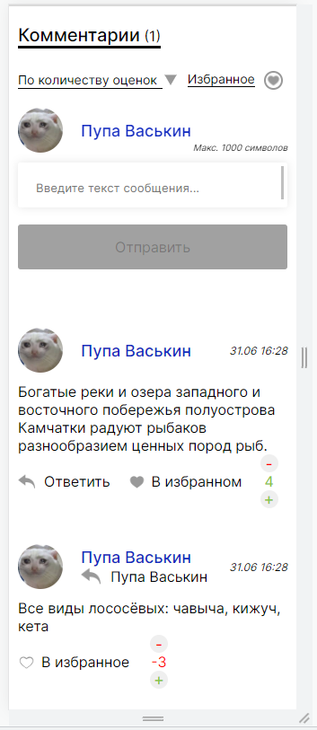
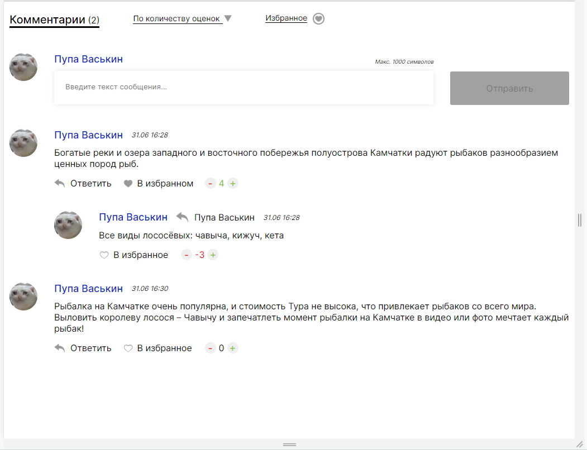

# Система комментирования (TypeScript, Vue.JS)

 Система написана на TypeScript и Vue.JS, Комментарии можно сортировать по дате, колличесту оценок и по колличеству ответов, так же можно отфильтровать избранные сообщения, textarea имеет валидацию на 1000 символов. Система комментирования адаптивна, корректно отображается на телефонах, планшетах и десктопах. Проект был сделан с целью ознакомления TypeScript и Vue.JS.
## Screenshots

  

## Установка

Intsall & Run
```bash
  npm i
  tsc index.ts
```


## 🚀 Контакты


Telegram: https://t.me/alekshelis

Email: alekshelis@yandex.ru